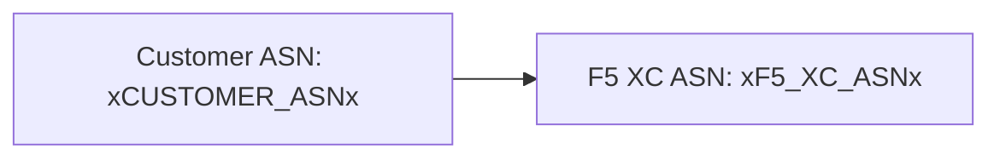

يدعم المُنشئ مخططات [Mermaid](https://mermaid.js.org/) من خلال معالجة على مرحلتين: إضافة remark في وقت البناء تُعد الترميز، ومُعالج من جانب العميل يُنتج ملف SVG.

## إضافة Remark

تعمل إضافة remark-mermaid (المُقدمة من حزمة `docs-theme` في npm) أثناء بناء Astro. تستخدم `unist-util-visit` للعثور على كتل التعليمات البرمجية المحاطة بسياج والتي تحتوي على `lang === 'mermaid'` وتستبدلها بـ HTML:

```js
visit(tree, 'code', (node, index, parent) => {
  if (node.lang !== 'mermaid' || index === undefined || !parent) return;

  const escaped = node.value
    .replace(/&/g, '&amp;')
    .replace(/</g, '&lt;')
    .replace(/>/g, '&gt;')
    .replace(/"/g, '&quot;');

  parent.children[index] = {
    type: 'html',
    value: `<div class="mermaid-container" data-mermaid-src="${escaped}">
              <pre class="mermaid">${node.value}</pre>
            </div>`,
  };
});
```

التفاصيل الرئيسية:

| الجانب | القيمة |
|--------|-------|
| نوع العقدة المطابقة | عقد `code` حيث `lang === 'mermaid'` |
| ترميز كيانات HTML | `&`، `<`، `>`، `"` — يمنع حقن السمات في `data-mermaid-src` |
| بنية الإخراج | `<div class="mermaid-container">` مع سمة `data-mermaid-src` تحتوي على المصدر المُرمَّز |
| المحتوى الاحتياطي | `<pre class="mermaid">` مع المصدر الخام (يظهر حتى يقوم JavaScript بالعرض) |

## العرض من جانب العميل

تتولى دالة `renderMermaidDiagrams()` في `src/scripts/placeholder-dom.ts` إنتاج SVG في المتصفح.

### استيراد Mermaid

يتم تحميل Mermaid عند الطلب من CDN — وهو غير مُضمَّن في الحزمة:

```ts
const mermaid = (await import('https://cdn.jsdelivr.net/npm/mermaid@11/dist/mermaid.esm.min.mjs')).default;
```

### التهيئة

```ts
mermaid.initialize({
  startOnLoad: false,
  theme: 'default',
  securityLevel: 'loose',
  themeVariables: {
    primaryColor: '#ffffff',
    primaryBorderColor: '#cccccc',
    background: '#ffffff',
    mainBkg: '#ffffff',
    secondBkg: '#ffffff',
    tertiaryColor: '#ffffff',
  },
});
```

يمنع `startOnLoad: false` مكتبة Mermaid من المسح التلقائي للصفحة. يسمح `securityLevel: 'loose'` بأحداث النقر والروابط في المخططات.

### حلقة العرض

لكل عنصر `.mermaid-container`:

1. قراءة مصدر المخطط الخام من `data-mermaid-src`
2. تشغيل استبدال العناصر النائبة على المصدر (انظر أدناه)
3. مسح الحاوية وإزالة أي سمة `data-processed`
4. استدعاء `mermaid.render()` بمعرف عشوائي لإنتاج SVG
5. تعيين `backgroundColor: 'white'` على عنصر `<svg>` المُعالَج

## استبدال العناصر النائبة في المخططات

قبل العرض، يمر مصدر المخطط عبر نفس دالة `substituteText()` المُستخدمة بواسطة مُتتبع DOM (انظر [نظام العناصر النائبة](../placeholder-system/) لآلية المُتتبع):

```ts
const template = container.getAttribute('data-mermaid-src') || '';
const substituted = substituteText(template, values);
```

هذا يعني أن رموز العناصر النائبة مثل `xCUSTOMER_ASNx` تعمل داخل تعريفات مخططات Mermaid. عندما يُغيّر المستخدم قيمة في النموذج، يُطلق حدث `placeholder-change` إعادة عرض كاملة لجميع المخططات بالقيم المُحدَّثة.

## معالجة الأخطاء

إذا أطلق `mermaid.render()` خطأً (على سبيل المثال، بسبب خطأ في صياغة مصدر المخطط)، يعرض كتلة الالتقاط الخطأ مباشرة في الحاوية:

```ts
} catch (e) {
  container.textContent = `Diagram error: ${e}`;
}
```

هذا يجعل أخطاء التأليف مرئية دون تعطيل بقية الصفحة.

## إعادة العرض

يتم إعادة عرض المخططات في حالتين:

| المُحفِّز | الحدث | ما يحدث |
|---------|-------|-------------|
| تغيير قيم العناصر النائبة | `placeholder-change` | تستدعي `handleChange()` دالة `renderMermaidDiagrams()` بالقيم الجديدة |
| التنقل بين صفحات Astro | `astro:page-load` | تستدعي `init()` دالة `renderMermaidDiagrams()` للصفحة الجديدة |

## صياغة التأليف

اكتب كتلة تعليمات برمجية محاطة بسياج قياسية مع علامة اللغة `mermaid`:

````markdown

````

تُحوِّل إضافة remark هذا إلى عنصر div حاوي في وقت البناء. يعرضه العميل كملف SVG مع استبدال قيم العناصر النائبة.
