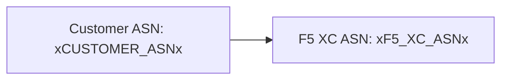

Der Builder unterstützt [Mermaid](https://mermaid.js.org/)-Diagramme mit zweiphasiger Verarbeitung: Ein Remark-Plugin bereitet das Markup zur Build-Zeit vor, und ein clientseitiger Renderer erzeugt das SVG.

## Remark-Plugin

Das remark-mermaid-Plugin (bereitgestellt durch das `docs-theme`-NPM-Paket) wird während des Astro-Builds ausgeführt. Es verwendet `unist-util-visit`, um eingezäunte Codeblöcke mit `lang === 'mermaid'` zu finden und durch HTML zu ersetzen:

```js
visit(tree, 'code', (node, index, parent) => {
  if (node.lang !== 'mermaid' || index === undefined || !parent) return;

  const escaped = node.value
    .replace(/&/g, '&amp;')
    .replace(/</g, '&lt;')
    .replace(/>/g, '&gt;')
    .replace(/"/g, '&quot;');

  parent.children[index] = {
    type: 'html',
    value: `<div class="mermaid-container" data-mermaid-src="${escaped}">
              <pre class="mermaid">${node.value}</pre>
            </div>`,
  };
});
```

Wichtige Details:

| Aspekt | Wert |
|--------|------|
| Übereinstimmender Knotentyp | `code`-Knoten, bei denen `lang === 'mermaid'` |
| HTML-Entity-Escaping | `&`, `<`, `>`, `"` — verhindert Attribut-Injection in `data-mermaid-src` |
| Ausgabestruktur | `<div class="mermaid-container">` mit `data-mermaid-src`-Attribut, das die escapte Quelle enthält |
| Fallback-Inhalt | `<pre class="mermaid">` mit dem Rohquelltext (sichtbar bis JS rendert) |

## Clientseitiges Rendering

Die Funktion `renderMermaidDiagrams()` in `src/scripts/placeholder-dom.ts` übernimmt die SVG-Generierung im Browser.

### Mermaid-Import

Mermaid wird bei Bedarf von einem CDN geladen — es wird nicht gebündelt:

```ts
const mermaid = (await import('https://cdn.jsdelivr.net/npm/mermaid@11/dist/mermaid.esm.min.mjs')).default;
```

### Initialisierung

```ts
mermaid.initialize({
  startOnLoad: false,
  theme: 'default',
  securityLevel: 'loose',
  themeVariables: {
    primaryColor: '#ffffff',
    primaryBorderColor: '#cccccc',
    background: '#ffffff',
    mainBkg: '#ffffff',
    secondBkg: '#ffffff',
    tertiaryColor: '#ffffff',
  },
});
```

`startOnLoad: false` verhindert, dass Mermaid die Seite automatisch durchsucht. `securityLevel: 'loose'` erlaubt Klick-Events und Links in Diagrammen.

### Render-Schleife

Für jedes `.mermaid-container`-Element:

1. Den rohen Diagramm-Quelltext aus `data-mermaid-src` lesen
2. Platzhalter-Substitution auf den Quelltext anwenden (siehe unten)
3. Den Container leeren und jedes `data-processed`-Attribut entfernen
4. `mermaid.render()` mit einer zufälligen ID aufrufen, um SVG zu erzeugen
5. `backgroundColor: 'white'` auf dem gerenderten `<svg>`-Element setzen

## Platzhalter-Substitution in Diagrammen

Vor dem Rendering durchläuft der Diagramm-Quelltext dieselbe `substituteText()`-Funktion, die auch vom DOM-Walker verwendet wird (siehe [Platzhalter-System](../placeholder-system/) für den Walker-Mechanismus):

```ts
const template = container.getAttribute('data-mermaid-src') || '';
const substituted = substituteText(template, values);
```

Das bedeutet, dass Platzhalter-Token wie `xCUSTOMER_ASNx` innerhalb von Mermaid-Diagrammdefinitionen funktionieren. Wenn ein Benutzer einen Wert im Formular ändert, löst das `placeholder-change`-Event ein vollständiges Neu-Rendering aller Diagramme mit aktualisierten Werten aus.

## Fehlerbehandlung

Wenn `mermaid.render()` eine Exception wirft (zum Beispiel aufgrund eines Syntaxfehlers im Diagramm-Quelltext), zeigt der Catch-Block den Fehler direkt im Container an:

```ts
} catch (e) {
  container.textContent = `Diagram error: ${e}`;
}
```

Dies macht Autorenfehler sichtbar, ohne den Rest der Seite zu beeinträchtigen.

## Neu-Rendering

Diagramme werden in zwei Situationen neu gerendert:

| Auslöser | Event | Was passiert |
|----------|-------|-------------|
| Platzhalter-Wert ändert sich | `placeholder-change` | `handleChange()` ruft `renderMermaidDiagrams()` mit neuen Werten auf |
| Astro-Seitennavigation | `astro:page-load` | `init()` ruft `renderMermaidDiagrams()` für die neue Seite auf |

## Autoren-Syntax

Schreiben Sie einen standardmäßigen eingezäunten Codeblock mit dem `mermaid`-Sprachtag:

````markdown

````

Das Remark-Plugin konvertiert dies zur Build-Zeit in ein Container-Div. Der Client rendert es als SVG mit substituierten Platzhalterwerten.
