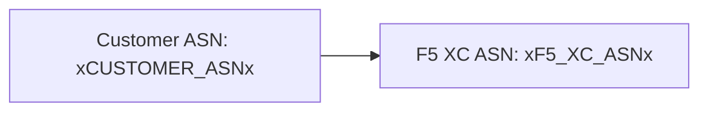

El constructor soporta diagramas [Mermaid](https://mermaid.js.org/) con procesamiento en dos fases: un plugin remark en tiempo de compilación prepara el marcado, y un renderizador del lado del cliente produce el SVG.

## Plugin Remark

El plugin remark-mermaid (proporcionado por el paquete npm `docs-theme`) se ejecuta durante la compilación de Astro. Utiliza `unist-util-visit` para encontrar bloques de código delimitados con `lang === 'mermaid'` y los reemplaza con HTML:

```js
visit(tree, 'code', (node, index, parent) => {
  if (node.lang !== 'mermaid' || index === undefined || !parent) return;

  const escaped = node.value
    .replace(/&/g, '&amp;')
    .replace(/</g, '&lt;')
    .replace(/>/g, '&gt;')
    .replace(/"/g, '&quot;');

  parent.children[index] = {
    type: 'html',
    value: `<div class="mermaid-container" data-mermaid-src="${escaped}">
              <pre class="mermaid">${node.value}</pre>
            </div>`,
  };
});
```

Detalles clave:

| Aspecto | Valor |
|---------|-------|
| Tipo de nodo coincidente | Nodos `code` donde `lang === 'mermaid'` |
| Escapado de entidades HTML | `&`, `<`, `>`, `"` — previene inyección de atributos en `data-mermaid-src` |
| Estructura de salida | `<div class="mermaid-container">` con atributo `data-mermaid-src` que contiene el código fuente escapado |
| Contenido de respaldo | `<pre class="mermaid">` con el código fuente sin procesar (visible hasta que JS lo renderiza) |

## Renderizado del Lado del Cliente

La función `renderMermaidDiagrams()` en `src/scripts/placeholder-dom.ts` se encarga de la generación de SVG en el navegador.

### Importación de Mermaid

Mermaid se carga bajo demanda desde un CDN — no se incluye en el paquete:

```ts
const mermaid = (await import('https://cdn.jsdelivr.net/npm/mermaid@11/dist/mermaid.esm.min.mjs')).default;
```

### Inicialización

```ts
mermaid.initialize({
  startOnLoad: false,
  theme: 'default',
  securityLevel: 'loose',
  themeVariables: {
    primaryColor: '#ffffff',
    primaryBorderColor: '#cccccc',
    background: '#ffffff',
    mainBkg: '#ffffff',
    secondBkg: '#ffffff',
    tertiaryColor: '#ffffff',
  },
});
```

`startOnLoad: false` evita que Mermaid escanee automáticamente la página. `securityLevel: 'loose'` permite eventos de clic y enlaces en los diagramas.

### Bucle de Renderizado

Para cada elemento `.mermaid-container`:

1. Lee el código fuente del diagrama desde `data-mermaid-src`
2. Ejecuta la sustitución de marcadores de posición en el código fuente (ver más abajo)
3. Limpia el contenedor y elimina cualquier atributo `data-processed`
4. Llama a `mermaid.render()` con un ID aleatorio para producir el SVG
5. Establece `backgroundColor: 'white'` en el elemento `<svg>` renderizado

## Sustitución de Marcadores de Posición en Diagramas

Antes del renderizado, el código fuente del diagrama pasa por la misma función `substituteText()` utilizada por el recorredor del DOM (consulte [Sistema de Marcadores de Posición](../placeholder-system/) para el mecanismo del recorredor):

```ts
const template = container.getAttribute('data-mermaid-src') || '';
const substituted = substituteText(template, values);
```

Esto significa que los tokens de marcadores de posición como `xCUSTOMER_ASNx` funcionan dentro de las definiciones de diagramas Mermaid. Cuando un usuario cambia un valor en el formulario, el evento `placeholder-change` activa un re-renderizado completo de todos los diagramas con los valores actualizados.

## Manejo de Errores

Si `mermaid.render()` lanza una excepción (por ejemplo, debido a un error de sintaxis en el código fuente del diagrama), el bloque catch muestra el error directamente en el contenedor:

```ts
} catch (e) {
  container.textContent = `Diagram error: ${e}`;
}
```

Esto hace visibles los errores de autoría sin interrumpir el resto de la página.

## Re-renderizado

Los diagramas se re-renderizan en dos situaciones:

| Disparador | Evento | Qué sucede |
|------------|--------|------------|
| Cambio en los valores de marcadores de posición | `placeholder-change` | `handleChange()` llama a `renderMermaidDiagrams()` con los nuevos valores |
| Navegación de página en Astro | `astro:page-load` | `init()` llama a `renderMermaidDiagrams()` para la nueva página |

## Sintaxis de Autoría

Escriba un bloque de código delimitado estándar con la etiqueta de lenguaje `mermaid`:

````markdown

````

El plugin remark convierte esto en un div contenedor en tiempo de compilación. El cliente lo renderiza como un SVG con los valores de los marcadores de posición sustituidos.
