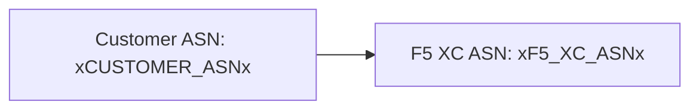

Le builder prend en charge les diagrammes [Mermaid](https://mermaid.js.org/) avec un traitement en deux phases : un plugin remark au moment du build prépare le balisage, et un moteur de rendu côté client produit le SVG.

## Plugin Remark

Le plugin remark-mermaid (fourni par le package npm `docs-theme`) s'exécute pendant le build Astro. Il utilise `unist-util-visit` pour trouver les blocs de code délimités avec `lang === 'mermaid'` et les remplace par du HTML :

```js
visit(tree, 'code', (node, index, parent) => {
  if (node.lang !== 'mermaid' || index === undefined || !parent) return;

  const escaped = node.value
    .replace(/&/g, '&amp;')
    .replace(/</g, '&lt;')
    .replace(/>/g, '&gt;')
    .replace(/"/g, '&quot;');

  parent.children[index] = {
    type: 'html',
    value: `<div class="mermaid-container" data-mermaid-src="${escaped}">
              <pre class="mermaid">${node.value}</pre>
            </div>`,
  };
});
```

Détails clés :

| Aspect | Valeur |
|--------|--------|
| Type de nœud correspondant | Nœuds `code` où `lang === 'mermaid'` |
| Échappement des entités HTML | `&`, `<`, `>`, `"` — empêche l'injection d'attributs dans `data-mermaid-src` |
| Structure de sortie | `<div class="mermaid-container">` avec l'attribut `data-mermaid-src` contenant la source échappée |
| Contenu de secours | `<pre class="mermaid">` avec la source brute (visible jusqu'au rendu par JS) |

## Rendu côté client

La fonction `renderMermaidDiagrams()` dans `src/scripts/placeholder-dom.ts` gère la génération SVG dans le navigateur.

### Import de Mermaid

Mermaid est chargé à la demande depuis un CDN — il n'est pas inclus dans le bundle :

```ts
const mermaid = (await import('https://cdn.jsdelivr.net/npm/mermaid@11/dist/mermaid.esm.min.mjs')).default;
```

### Initialisation

```ts
mermaid.initialize({
  startOnLoad: false,
  theme: 'default',
  securityLevel: 'loose',
  themeVariables: {
    primaryColor: '#ffffff',
    primaryBorderColor: '#cccccc',
    background: '#ffffff',
    mainBkg: '#ffffff',
    secondBkg: '#ffffff',
    tertiaryColor: '#ffffff',
  },
});
```

`startOnLoad: false` empêche Mermaid de scanner automatiquement la page. `securityLevel: 'loose'` autorise les événements de clic et les liens dans les diagrammes.

### Boucle de rendu

Pour chaque élément `.mermaid-container` :

1. Lire la source brute du diagramme depuis `data-mermaid-src`
2. Exécuter la substitution des variables sur la source (voir ci-dessous)
3. Vider le conteneur et supprimer tout attribut `data-processed`
4. Appeler `mermaid.render()` avec un ID aléatoire pour produire le SVG
5. Définir `backgroundColor: 'white'` sur l'élément `<svg>` rendu

## Substitution des variables dans les diagrammes

Avant le rendu, la source du diagramme passe par la même fonction `substituteText()` utilisée par le parcoureur DOM (voir [Système de variables](../placeholder-system/) pour le mécanisme de parcours) :

```ts
const template = container.getAttribute('data-mermaid-src') || '';
const substituted = substituteText(template, values);
```

Cela signifie que les jetons de substitution comme `xCUSTOMER_ASNx` fonctionnent à l'intérieur des définitions de diagrammes Mermaid. Lorsqu'un utilisateur modifie une valeur dans le formulaire, l'événement `placeholder-change` déclenche un re-rendu complet de tous les diagrammes avec les valeurs mises à jour.

## Gestion des erreurs

Si `mermaid.render()` lève une exception (par exemple, en raison d'une erreur de syntaxe dans la source du diagramme), le bloc catch affiche l'erreur directement dans le conteneur :

```ts
} catch (e) {
  container.textContent = `Diagram error: ${e}`;
}
```

Cela rend les erreurs de rédaction visibles sans interrompre le reste de la page.

## Re-rendu

Les diagrammes sont re-rendus dans deux situations :

| Déclencheur | Événement | Ce qui se passe |
|-------------|-----------|-----------------|
| Changement de valeur d'une variable | `placeholder-change` | `handleChange()` appelle `renderMermaidDiagrams()` avec les nouvelles valeurs |
| Navigation de page Astro | `astro:page-load` | `init()` appelle `renderMermaidDiagrams()` pour la nouvelle page |

## Syntaxe de rédaction

Écrivez un bloc de code délimité standard avec le tag de langage `mermaid` :

````markdown

````

Le plugin remark convertit cela en un div conteneur au moment du build. Le client le rend sous forme de SVG avec les valeurs de variables substituées.
