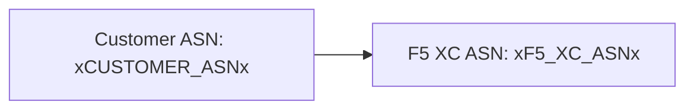

बिल्डर दो-चरणीय प्रोसेसिंग के साथ [Mermaid](https://mermaid.js.org/) आरेखों का समर्थन करता है: बिल्ड समय पर एक remark प्लगइन मार्कअप तैयार करता है, और एक क्लाइंट-साइड रेंडरर SVG उत्पन्न करता है।

## Remark प्लगइन

remark-mermaid प्लगइन (`docs-theme` npm पैकेज द्वारा प्रदान किया गया) Astro बिल्ड के दौरान चलता है। यह `unist-util-visit` का उपयोग करके `lang === 'mermaid'` वाले फेंस्ड कोड ब्लॉक्स ढूंढता है और उन्हें HTML से बदल देता है:

```js
visit(tree, 'code', (node, index, parent) => {
  if (node.lang !== 'mermaid' || index === undefined || !parent) return;

  const escaped = node.value
    .replace(/&/g, '&amp;')
    .replace(/</g, '&lt;')
    .replace(/>/g, '&gt;')
    .replace(/"/g, '&quot;');

  parent.children[index] = {
    type: 'html',
    value: `<div class="mermaid-container" data-mermaid-src="${escaped}">
              <pre class="mermaid">${node.value}</pre>
            </div>`,
  };
});
```

मुख्य विवरण:

| पहलू | मान |
|--------|-------|
| मिलान किया गया नोड प्रकार | `code` नोड्स जहाँ `lang === 'mermaid'` |
| HTML एंटिटी एस्केपिंग | `&`, `<`, `>`, `"` — `data-mermaid-src` में एट्रिब्यूट इंजेक्शन रोकता है |
| आउटपुट संरचना | `<div class="mermaid-container">` जिसमें `data-mermaid-src` एट्रिब्यूट एस्केप्ड सोर्स रखता है |
| फ़ॉलबैक सामग्री | `<pre class="mermaid">` कच्चे सोर्स के साथ (JS रेंडर करने तक दिखाई देता है) |

## क्लाइंट-साइड रेंडरिंग

`src/scripts/placeholder-dom.ts` में `renderMermaidDiagrams()` फ़ंक्शन ब्राउज़र में SVG जनरेशन को संभालता है।

### Mermaid इम्पोर्ट

Mermaid CDN से ऑन-डिमांड लोड होता है — यह बंडल नहीं किया जाता:

```ts
const mermaid = (await import('https://cdn.jsdelivr.net/npm/mermaid@11/dist/mermaid.esm.min.mjs')).default;
```

### इनिशियलाइज़ेशन

```ts
mermaid.initialize({
  startOnLoad: false,
  theme: 'default',
  securityLevel: 'loose',
  themeVariables: {
    primaryColor: '#ffffff',
    primaryBorderColor: '#cccccc',
    background: '#ffffff',
    mainBkg: '#ffffff',
    secondBkg: '#ffffff',
    tertiaryColor: '#ffffff',
  },
});
```

`startOnLoad: false` Mermaid को पेज को ऑटो-स्कैन करने से रोकता है। `securityLevel: 'loose'` आरेखों में क्लिक इवेंट्स और लिंक्स की अनुमति देता है।

### रेंडर लूप

प्रत्येक `.mermaid-container` एलिमेंट के लिए:

1. `data-mermaid-src` से कच्चा आरेख सोर्स पढ़ें
2. सोर्स पर प्लेसहोल्डर प्रतिस्थापन चलाएँ (नीचे देखें)
3. कंटेनर साफ़ करें और कोई भी `data-processed` एट्रिब्यूट हटाएँ
4. SVG उत्पन्न करने के लिए एक रैंडम ID के साथ `mermaid.render()` कॉल करें
5. रेंडर किए गए `<svg>` एलिमेंट पर `backgroundColor: 'white'` सेट करें

## आरेखों में प्लेसहोल्डर प्रतिस्थापन

रेंडरिंग से पहले, आरेख सोर्स उसी `substituteText()` फ़ंक्शन से गुज़रता है जो DOM वॉकर द्वारा उपयोग किया जाता है (वॉकर तंत्र के लिए [प्लेसहोल्डर सिस्टम](../placeholder-system/) देखें):

```ts
const template = container.getAttribute('data-mermaid-src') || '';
const substituted = substituteText(template, values);
```

इसका मतलब है कि `xCUSTOMER_ASNx` जैसे प्लेसहोल्डर टोकन Mermaid आरेख परिभाषाओं के अंदर काम करते हैं। जब कोई उपयोगकर्ता फ़ॉर्म में कोई मान बदलता है, तो `placeholder-change` इवेंट अपडेटेड मानों के साथ सभी आरेखों का पूर्ण री-रेंडर ट्रिगर करता है।

## त्रुटि प्रबंधन

यदि `mermaid.render()` थ्रो करता है (उदाहरण के लिए, आरेख सोर्स में सिंटैक्स त्रुटि के कारण), तो catch ब्लॉक त्रुटि को सीधे कंटेनर में प्रदर्शित करता है:

```ts
} catch (e) {
  container.textContent = `Diagram error: ${e}`;
}
```

यह शेष पेज को तोड़े बिना लेखन त्रुटियों को दृश्यमान बनाता है।

## री-रेंडरिंग

आरेख दो स्थितियों में री-रेंडर होते हैं:

| ट्रिगर | इवेंट | क्या होता है |
|---------|-------|-------------|
| प्लेसहोल्डर मान बदलता है | `placeholder-change` | `handleChange()` नए मानों के साथ `renderMermaidDiagrams()` कॉल करता है |
| Astro पेज नेविगेशन | `astro:page-load` | `init()` नए पेज के लिए `renderMermaidDiagrams()` कॉल करता है |

## लेखन सिंटैक्स

`mermaid` भाषा टैग के साथ एक मानक फेंस्ड कोड ब्लॉक लिखें:

````markdown

````

Remark प्लगइन इसे बिल्ड समय पर एक कंटेनर div में बदल देता है। क्लाइंट इसे प्लेसहोल्डर मानों को प्रतिस्थापित करके SVG के रूप में रेंडर करता है।
