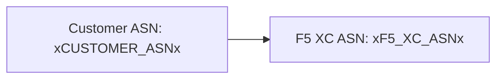

Il builder supporta i diagrammi [Mermaid](https://mermaid.js.org/) con un'elaborazione a due fasi: un plugin remark al momento della build prepara il markup, e un renderer lato client produce l'SVG.

## Plugin Remark

Il plugin remark-mermaid (fornito dal pacchetto npm `docs-theme`) viene eseguito durante la build di Astro. Utilizza `unist-util-visit` per trovare i blocchi di codice delimitati con `lang === 'mermaid'` e li sostituisce con HTML:

```js
visit(tree, 'code', (node, index, parent) => {
  if (node.lang !== 'mermaid' || index === undefined || !parent) return;

  const escaped = node.value
    .replace(/&/g, '&amp;')
    .replace(/</g, '&lt;')
    .replace(/>/g, '&gt;')
    .replace(/"/g, '&quot;');

  parent.children[index] = {
    type: 'html',
    value: `<div class="mermaid-container" data-mermaid-src="${escaped}">
              <pre class="mermaid">${node.value}</pre>
            </div>`,
  };
});
```

Dettagli chiave:

| Aspetto | Valore |
|---------|--------|
| Tipo di nodo corrispondente | Nodi `code` dove `lang === 'mermaid'` |
| Escaping delle entità HTML | `&`, `<`, `>`, `"` — previene l'injection negli attributi in `data-mermaid-src` |
| Struttura dell'output | `<div class="mermaid-container">` con attributo `data-mermaid-src` contenente il sorgente con escaping |
| Contenuto di fallback | `<pre class="mermaid">` con il sorgente grezzo (visibile fino a quando JS non esegue il rendering) |

## Rendering Lato Client

La funzione `renderMermaidDiagrams()` in `src/scripts/placeholder-dom.ts` gestisce la generazione SVG nel browser.

### Importazione di Mermaid

Mermaid viene caricato su richiesta da un CDN — non è incluso nel bundle:

```ts
const mermaid = (await import('https://cdn.jsdelivr.net/npm/mermaid@11/dist/mermaid.esm.min.mjs')).default;
```

### Inizializzazione

```ts
mermaid.initialize({
  startOnLoad: false,
  theme: 'default',
  securityLevel: 'loose',
  themeVariables: {
    primaryColor: '#ffffff',
    primaryBorderColor: '#cccccc',
    background: '#ffffff',
    mainBkg: '#ffffff',
    secondBkg: '#ffffff',
    tertiaryColor: '#ffffff',
  },
});
```

`startOnLoad: false` impedisce a Mermaid di scansionare automaticamente la pagina. `securityLevel: 'loose'` consente eventi click e link nei diagrammi.

### Ciclo di Rendering

Per ogni elemento `.mermaid-container`:

1. Legge il sorgente grezzo del diagramma da `data-mermaid-src`
2. Esegue la sostituzione dei segnaposto sul sorgente (vedi sotto)
3. Svuota il container e rimuove qualsiasi attributo `data-processed`
4. Chiama `mermaid.render()` con un ID casuale per produrre l'SVG
5. Imposta `backgroundColor: 'white'` sull'elemento `<svg>` renderizzato

## Sostituzione dei Segnaposto nei Diagrammi

Prima del rendering, il sorgente del diagramma passa attraverso la stessa funzione `substituteText()` utilizzata dal walker del DOM (vedi [Sistema dei Segnaposto](../placeholder-system/) per il meccanismo del walker):

```ts
const template = container.getAttribute('data-mermaid-src') || '';
const substituted = substituteText(template, values);
```

Questo significa che i token segnaposto come `xCUSTOMER_ASNx` funzionano all'interno delle definizioni dei diagrammi Mermaid. Quando un utente modifica un valore nel form, l'evento `placeholder-change` attiva un re-rendering completo di tutti i diagrammi con i valori aggiornati.

## Gestione degli Errori

Se `mermaid.render()` genera un'eccezione (ad esempio, a causa di un errore di sintassi nel sorgente del diagramma), il blocco catch visualizza l'errore direttamente nel container:

```ts
} catch (e) {
  container.textContent = `Diagram error: ${e}`;
}
```

Questo rende visibili gli errori di authoring senza compromettere il resto della pagina.

## Re-rendering

I diagrammi vengono ri-renderizzati in due situazioni:

| Trigger | Evento | Cosa succede |
|---------|--------|-------------|
| Modifica dei valori dei segnaposto | `placeholder-change` | `handleChange()` chiama `renderMermaidDiagrams()` con i nuovi valori |
| Navigazione pagina Astro | `astro:page-load` | `init()` chiama `renderMermaidDiagrams()` per la nuova pagina |

## Sintassi di Authoring

Scrivete un blocco di codice delimitato standard con il tag di linguaggio `mermaid`:

````markdown

````

Il plugin remark converte questo in un div container al momento della build. Il client lo renderizza come SVG con i valori dei segnaposto sostituiti.
