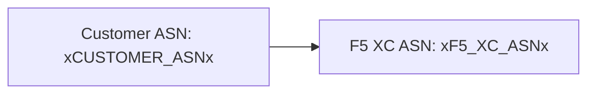

ビルダーは [Mermaid](https://mermaid.js.org/) ダイアグラムを2段階処理でサポートしています。ビルド時にremarkプラグインがマークアップを準備し、クライアントサイドのレンダラーがSVGを生成します。

## Remarkプラグイン

remark-mermaidプラグイン（`docs-theme` npmパッケージで提供）はAstroのビルド中に実行されます。`unist-util-visit`を使用して`lang === 'mermaid'`のフェンス付きコードブロックを見つけ、HTMLに置換します：

```js
visit(tree, 'code', (node, index, parent) => {
  if (node.lang !== 'mermaid' || index === undefined || !parent) return;

  const escaped = node.value
    .replace(/&/g, '&amp;')
    .replace(/</g, '&lt;')
    .replace(/>/g, '&gt;')
    .replace(/"/g, '&quot;');

  parent.children[index] = {
    type: 'html',
    value: `<div class="mermaid-container" data-mermaid-src="${escaped}">
              <pre class="mermaid">${node.value}</pre>
            </div>`,
  };
});
```

主な詳細：

| 項目 | 値 |
|--------|-------|
| マッチするノードタイプ | `lang === 'mermaid'` である `code` ノード |
| HTMLエンティティエスケープ | `&`, `<`, `>`, `"` — `data-mermaid-src` への属性インジェクションを防止 |
| 出力構造 | エスケープされたソースを保持する `data-mermaid-src` 属性付きの `<div class="mermaid-container">` |
| フォールバックコンテンツ | 生のソースを含む `<pre class="mermaid">`（JSがレンダリングするまで表示される） |

## クライアントサイドレンダリング

`src/scripts/placeholder-dom.ts` 内の `renderMermaidDiagrams()` 関数がブラウザでのSVG生成を処理します。

### Mermaidのインポート

Mermaidはバンドルされず、CDNからオンデマンドで読み込まれます：

```ts
const mermaid = (await import('https://cdn.jsdelivr.net/npm/mermaid@11/dist/mermaid.esm.min.mjs')).default;
```

### 初期化

```ts
mermaid.initialize({
  startOnLoad: false,
  theme: 'default',
  securityLevel: 'loose',
  themeVariables: {
    primaryColor: '#ffffff',
    primaryBorderColor: '#cccccc',
    background: '#ffffff',
    mainBkg: '#ffffff',
    secondBkg: '#ffffff',
    tertiaryColor: '#ffffff',
  },
});
```

`startOnLoad: false` はMermaidがページを自動スキャンすることを防ぎます。`securityLevel: 'loose'` はダイアグラム内のクリックイベントとリンクを許可します。

### レンダリングループ

各 `.mermaid-container` 要素に対して：

1. `data-mermaid-src` から生のダイアグラムソースを読み取る
2. ソースに対してプレースホルダー置換を実行する（下記参照）
3. コンテナをクリアし、`data-processed` 属性を削除する
4. ランダムIDを指定して `mermaid.render()` を呼び出し、SVGを生成する
5. レンダリングされた `<svg>` 要素に `backgroundColor: 'white'` を設定する

## ダイアグラム内のプレースホルダー置換

レンダリング前に、ダイアグラムソースはDOMウォーカーで使用されるものと同じ `substituteText()` 関数を通過します（ウォーカーメカニズムについては[プレースホルダーシステム](../placeholder-system/)を参照）：

```ts
const template = container.getAttribute('data-mermaid-src') || '';
const substituted = substituteText(template, values);
```

これにより、`xCUSTOMER_ASNx` のようなプレースホルダートークンがMermaidダイアグラム定義内で機能します。ユーザーがフォームで値を変更すると、`placeholder-change` イベントが更新された値ですべてのダイアグラムの完全な再レンダリングをトリガーします。

## エラーハンドリング

`mermaid.render()` がスローした場合（例えば、ダイアグラムソースの構文エラーによる場合）、catchブロックがコンテナ内にエラーを直接表示します：

```ts
} catch (e) {
  container.textContent = `Diagram error: ${e}`;
}
```

これにより、ページの残りの部分を壊すことなくオーサリングエラーが可視化されます。

## 再レンダリング

ダイアグラムは2つの状況で再レンダリングされます：

| トリガー | イベント | 動作 |
|---------|-------|-------------|
| プレースホルダー値の変更 | `placeholder-change` | `handleChange()` が新しい値で `renderMermaidDiagrams()` を呼び出す |
| Astroページナビゲーション | `astro:page-load` | `init()` が新しいページに対して `renderMermaidDiagrams()` を呼び出す |

## オーサリング構文

`mermaid` 言語タグを付けた標準的なフェンス付きコードブロックを記述します：

````markdown

````

remarkプラグインがビルド時にこれをコンテナdivに変換します。クライアントがプレースホルダー値を置換した状態でSVGとしてレンダリングします。
