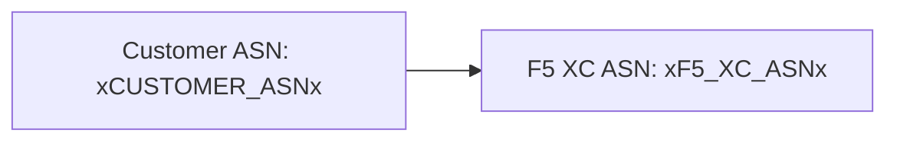

ビルダーは [Mermaid](https://mermaid.js.org/) ダイアグラムを2段階処理でサポートしています：ビルド時に remark プラグインがマークアップを準備し、クライアントサイドのレンダラーが SVG を生成します。

## Remark プラグイン

remark-mermaid プラグイン（`docs-theme` npm パッケージで提供）は Astro のビルド中に実行されます。`unist-util-visit` を使用して `lang === 'mermaid'` のフェンス付きコードブロックを検出し、HTML に置換します：

```js
visit(tree, 'code', (node, index, parent) => {
  if (node.lang !== 'mermaid' || index === undefined || !parent) return;

  const escaped = node.value
    .replace(/&/g, '&amp;')
    .replace(/</g, '&lt;')
    .replace(/>/g, '&gt;')
    .replace(/"/g, '&quot;');

  parent.children[index] = {
    type: 'html',
    value: `<div class="mermaid-container" data-mermaid-src="${escaped}">
              <pre class="mermaid">${node.value}</pre>
            </div>`,
  };
});
```

主要な詳細：

| 項目 | 値 |
|--------|-------|
| マッチするノードタイプ | `lang === 'mermaid'` の `code` ノード |
| HTML エンティティエスケープ | `&`、`<`、`>`、`"` — `data-mermaid-src` への属性インジェクションを防止 |
| 出力構造 | エスケープされたソースを保持する `data-mermaid-src` 属性付きの `<div class="mermaid-container">` |
| フォールバックコンテンツ | 生のソースを含む `<pre class="mermaid">`（JS がレンダリングするまで表示される） |

## クライアントサイドレンダリング

`src/scripts/placeholder-dom.ts` 内の `renderMermaidDiagrams()` 関数がブラウザで SVG 生成を処理します。

### Mermaid のインポート

Mermaid はバンドルされず、CDN からオンデマンドで読み込まれます：

```ts
const mermaid = (await import('https://cdn.jsdelivr.net/npm/mermaid@11/dist/mermaid.esm.min.mjs')).default;
```

### 初期化

```ts
mermaid.initialize({
  startOnLoad: false,
  theme: 'default',
  securityLevel: 'loose',
  themeVariables: {
    primaryColor: '#ffffff',
    primaryBorderColor: '#cccccc',
    background: '#ffffff',
    mainBkg: '#ffffff',
    secondBkg: '#ffffff',
    tertiaryColor: '#ffffff',
  },
});
```

`startOnLoad: false` は Mermaid がページを自動スキャンすることを防止します。`securityLevel: 'loose'` はダイアグラム内のクリックイベントとリンクを許可します。

### レンダーループ

各 `.mermaid-container` 要素に対して：

1. `data-mermaid-src` から生のダイアグラムソースを読み取る
2. ソースに対してプレースホルダー置換を実行する（以下を参照）
3. コンテナをクリアし、`data-processed` 属性があれば削除する
4. ランダム ID を使用して `mermaid.render()` を呼び出し、SVG を生成する
5. レンダリングされた `<svg>` 要素に `backgroundColor: 'white'` を設定する

## ダイアグラム内のプレースホルダー置換

レンダリング前に、ダイアグラムソースは DOM ウォーカーで使用されるのと同じ `substituteText()` 関数を通過します（ウォーカーの仕組みについては[プレースホルダーシステム](../placeholder-system/)を参照）：

```ts
const template = container.getAttribute('data-mermaid-src') || '';
const substituted = substituteText(template, values);
```

これにより、`xCUSTOMER_ASNx` のようなプレースホルダートークンが Mermaid ダイアグラム定義内で機能します。ユーザーがフォームで値を変更すると、`placeholder-change` イベントが更新された値ですべてのダイアグラムの完全な再レンダリングをトリガーします。

## エラーハンドリング

`mermaid.render()` がスロー（例えば、ダイアグラムソースの構文エラーによる）した場合、catch ブロックがコンテナ内にエラーを直接表示します：

```ts
} catch (e) {
  container.textContent = `Diagram error: ${e}`;
}
```

これにより、ページの他の部分を壊すことなくオーサリングエラーが可視化されます。

## 再レンダリング

ダイアグラムは2つの状況で再レンダリングされます：

| トリガー | イベント | 動作 |
|---------|-------|-------------|
| プレースホルダー値の変更 | `placeholder-change` | `handleChange()` が新しい値で `renderMermaidDiagrams()` を呼び出す |
| Astro ページナビゲーション | `astro:page-load` | `init()` が新しいページに対して `renderMermaidDiagrams()` を呼び出す |

## オーサリング構文

`mermaid` 言語タグ付きの標準的なフェンス付きコードブロックを記述します：

````markdown

````

remark プラグインはビルド時にこれをコンテナ div に変換します。クライアントはプレースホルダー値を置換した SVG としてレンダリングします。
