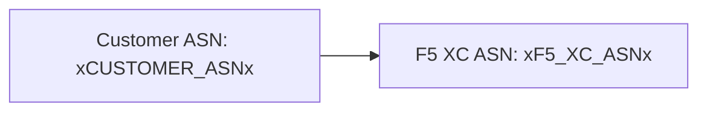

빌더는 2단계 처리를 통해 [Mermaid](https://mermaid.js.org/) 다이어그램을 지원합니다: 빌드 시점에 remark 플러그인이 마크업을 준비하고, 클라이언트 측 렌더러가 SVG를 생성합니다.

## Remark 플러그인

remark-mermaid 플러그인(`docs-theme` npm 패키지에서 제공)은 Astro 빌드 중에 실행됩니다. `unist-util-visit`을 사용하여 `lang === 'mermaid'`인 펜스드 코드 블록을 찾아 HTML로 대체합니다:

```js
visit(tree, 'code', (node, index, parent) => {
  if (node.lang !== 'mermaid' || index === undefined || !parent) return;

  const escaped = node.value
    .replace(/&/g, '&amp;')
    .replace(/</g, '&lt;')
    .replace(/>/g, '&gt;')
    .replace(/"/g, '&quot;');

  parent.children[index] = {
    type: 'html',
    value: `<div class="mermaid-container" data-mermaid-src="${escaped}">
              <pre class="mermaid">${node.value}</pre>
            </div>`,
  };
});
```

주요 세부사항:

| 항목 | 값 |
|--------|-------|
| 매칭되는 노드 타입 | `lang === 'mermaid'`인 `code` 노드 |
| HTML 엔티티 이스케이프 | `&`, `<`, `>`, `"` — `data-mermaid-src`에서 속성 주입을 방지 |
| 출력 구조 | 이스케이프된 소스를 담는 `data-mermaid-src` 속성이 포함된 `<div class="mermaid-container">` |
| 폴백 콘텐츠 | 원본 소스가 포함된 `<pre class="mermaid">` (JS가 렌더링할 때까지 표시됨) |

## 클라이언트 측 렌더링

`src/scripts/placeholder-dom.ts`의 `renderMermaidDiagrams()` 함수가 브라우저에서 SVG 생성을 처리합니다.

### Mermaid 임포트

Mermaid는 CDN에서 온디맨드로 로드되며 번들에 포함되지 않습니다:

```ts
const mermaid = (await import('https://cdn.jsdelivr.net/npm/mermaid@11/dist/mermaid.esm.min.mjs')).default;
```

### 초기화

```ts
mermaid.initialize({
  startOnLoad: false,
  theme: 'default',
  securityLevel: 'loose',
  themeVariables: {
    primaryColor: '#ffffff',
    primaryBorderColor: '#cccccc',
    background: '#ffffff',
    mainBkg: '#ffffff',
    secondBkg: '#ffffff',
    tertiaryColor: '#ffffff',
  },
});
```

`startOnLoad: false`는 Mermaid가 페이지를 자동 스캔하는 것을 방지합니다. `securityLevel: 'loose'`는 다이어그램에서 클릭 이벤트와 링크를 허용합니다.

### 렌더 루프

각 `.mermaid-container` 요소에 대해:

1. `data-mermaid-src`에서 원본 다이어그램 소스를 읽습니다
2. 소스에 대해 플레이스홀더 치환을 실행합니다 (아래 참조)
3. 컨테이너를 비우고 `data-processed` 속성을 제거합니다
4. 랜덤 ID와 함께 `mermaid.render()`를 호출하여 SVG를 생성합니다
5. 렌더링된 `<svg>` 요소에 `backgroundColor: 'white'`를 설정합니다

## 다이어그램 내 플레이스홀더 치환

렌더링 전에 다이어그램 소스는 DOM 워커에서 사용하는 것과 동일한 `substituteText()` 함수를 거칩니다 (워커 메커니즘에 대해서는 [플레이스홀더 시스템](../placeholder-system/)을 참조하세요):

```ts
const template = container.getAttribute('data-mermaid-src') || '';
const substituted = substituteText(template, values);
```

이는 `xCUSTOMER_ASNx`와 같은 플레이스홀더 토큰이 Mermaid 다이어그램 정의 내에서 작동한다는 것을 의미합니다. 사용자가 폼에서 값을 변경하면 `placeholder-change` 이벤트가 업데이트된 값으로 모든 다이어그램의 전체 재렌더링을 트리거합니다.

## 오류 처리

`mermaid.render()`에서 오류가 발생하면 (예: 다이어그램 소스의 구문 오류), catch 블록이 컨테이너에 직접 오류를 표시합니다:

```ts
} catch (e) {
  container.textContent = `Diagram error: ${e}`;
}
```

이를 통해 페이지의 나머지 부분을 중단하지 않으면서 작성 오류를 확인할 수 있습니다.

## 재렌더링

다이어그램은 두 가지 상황에서 재렌더링됩니다:

| 트리거 | 이벤트 | 동작 |
|---------|-------|-------------|
| 플레이스홀더 값 변경 | `placeholder-change` | `handleChange()`가 새 값으로 `renderMermaidDiagrams()`를 호출 |
| Astro 페이지 네비게이션 | `astro:page-load` | `init()`이 새 페이지에 대해 `renderMermaidDiagrams()`를 호출 |

## 작성 구문

`mermaid` 언어 태그를 사용하여 표준 펜스드 코드 블록을 작성합니다:

````markdown

````

remark 플러그인이 빌드 시점에 이를 컨테이너 div로 변환합니다. 클라이언트는 플레이스홀더 값이 치환된 상태로 SVG를 렌더링합니다.
