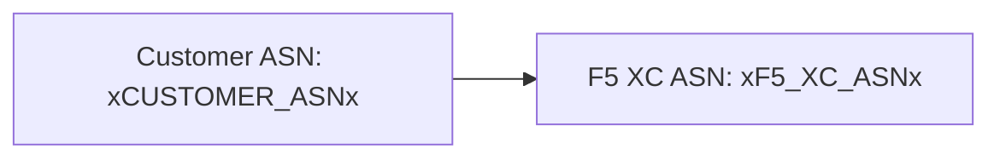

O builder suporta diagramas [Mermaid](https://mermaid.js.org/) com processamento em duas fases: um plugin remark no momento da build prepara a marcação, e um renderizador no lado do cliente produz o SVG.

## Plugin Remark

O plugin remark-mermaid (fornecido pelo pacote npm `docs-theme`) é executado durante a build do Astro. Ele utiliza `unist-util-visit` para encontrar blocos de código cercados com `lang === 'mermaid'` e os substitui por HTML:

```js
visit(tree, 'code', (node, index, parent) => {
  if (node.lang !== 'mermaid' || index === undefined || !parent) return;

  const escaped = node.value
    .replace(/&/g, '&amp;')
    .replace(/</g, '&lt;')
    .replace(/>/g, '&gt;')
    .replace(/"/g, '&quot;');

  parent.children[index] = {
    type: 'html',
    value: `<div class="mermaid-container" data-mermaid-src="${escaped}">
              <pre class="mermaid">${node.value}</pre>
            </div>`,
  };
});
```

Detalhes importantes:

| Aspecto | Valor |
|---------|-------|
| Tipo de nó correspondido | Nós `code` onde `lang === 'mermaid'` |
| Escape de entidades HTML | `&`, `<`, `>`, `"` — previne injeção de atributos em `data-mermaid-src` |
| Estrutura de saída | `<div class="mermaid-container">` com atributo `data-mermaid-src` contendo o código-fonte escapado |
| Conteúdo de fallback | `<pre class="mermaid">` com o código-fonte bruto (visível até o JS renderizar) |

## Renderização no Lado do Cliente

A função `renderMermaidDiagrams()` em `src/scripts/placeholder-dom.ts` gerencia a geração de SVG no navegador.

### Importação do Mermaid

O Mermaid é carregado sob demanda a partir de um CDN — ele não é empacotado no bundle:

```ts
const mermaid = (await import('https://cdn.jsdelivr.net/npm/mermaid@11/dist/mermaid.esm.min.mjs')).default;
```

### Inicialização

```ts
mermaid.initialize({
  startOnLoad: false,
  theme: 'default',
  securityLevel: 'loose',
  themeVariables: {
    primaryColor: '#ffffff',
    primaryBorderColor: '#cccccc',
    background: '#ffffff',
    mainBkg: '#ffffff',
    secondBkg: '#ffffff',
    tertiaryColor: '#ffffff',
  },
});
```

`startOnLoad: false` impede que o Mermaid escaneie automaticamente a página. `securityLevel: 'loose'` permite eventos de clique e links nos diagramas.

### Loop de Renderização

Para cada elemento `.mermaid-container`:

1. Lê o código-fonte bruto do diagrama a partir de `data-mermaid-src`
2. Executa a substituição de placeholders no código-fonte (veja abaixo)
3. Limpa o container e remove qualquer atributo `data-processed`
4. Chama `mermaid.render()` com um ID aleatório para produzir o SVG
5. Define `backgroundColor: 'white'` no elemento `<svg>` renderizado

## Substituição de Placeholders em Diagramas

Antes da renderização, o código-fonte do diagrama passa pela mesma função `substituteText()` utilizada pelo walker do DOM (veja [Sistema de Placeholders](../placeholder-system/) para o mecanismo do walker):

```ts
const template = container.getAttribute('data-mermaid-src') || '';
const substituted = substituteText(template, values);
```

Isso significa que tokens de placeholder como `xCUSTOMER_ASNx` funcionam dentro das definições de diagramas Mermaid. Quando um usuário altera um valor no formulário, o evento `placeholder-change` aciona uma re-renderização completa de todos os diagramas com os valores atualizados.

## Tratamento de Erros

Se `mermaid.render()` lançar uma exceção (por exemplo, devido a um erro de sintaxe no código-fonte do diagrama), o bloco catch exibe o erro diretamente no container:

```ts
} catch (e) {
  container.textContent = `Diagram error: ${e}`;
}
```

Isso torna erros de autoria visíveis sem quebrar o restante da página.

## Re-renderização

Os diagramas são re-renderizados em duas situações:

| Gatilho | Evento | O que acontece |
|---------|--------|----------------|
| Alteração de valores de placeholder | `placeholder-change` | `handleChange()` chama `renderMermaidDiagrams()` com os novos valores |
| Navegação de página do Astro | `astro:page-load` | `init()` chama `renderMermaidDiagrams()` para a nova página |

## Sintaxe de Autoria

Escreva um bloco de código cercado padrão com a tag de linguagem `mermaid`:

````markdown

````

O plugin remark converte isso em uma div container no momento da build. O cliente renderiza como um SVG com os valores de placeholder substituídos.
