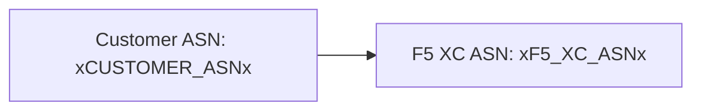

ตัวสร้างรองรับไดอะแกรม [Mermaid](https://mermaid.js.org/) ด้วยการประมวลผลแบบสองเฟส: remark plugin ในเวลาบิลด์จะเตรียม markup และตัวเรนเดอร์ฝั่งไคลเอนต์จะสร้าง SVG

## Remark Plugin

remark-mermaid plugin (จัดเตรียมโดยแพ็กเกจ npm `docs-theme`) ทำงานระหว่างการบิลด์ของ Astro โดยใช้ `unist-util-visit` เพื่อค้นหา fenced code blocks ที่มี `lang === 'mermaid'` และแทนที่ด้วย HTML:

```js
visit(tree, 'code', (node, index, parent) => {
  if (node.lang !== 'mermaid' || index === undefined || !parent) return;

  const escaped = node.value
    .replace(/&/g, '&amp;')
    .replace(/</g, '&lt;')
    .replace(/>/g, '&gt;')
    .replace(/"/g, '&quot;');

  parent.children[index] = {
    type: 'html',
    value: `<div class="mermaid-container" data-mermaid-src="${escaped}">
              <pre class="mermaid">${node.value}</pre>
            </div>`,
  };
});
```

รายละเอียดสำคัญ:

| ด้าน | ค่า |
|--------|-------|
| ประเภทโหนดที่จับคู่ | โหนด `code` ที่ `lang === 'mermaid'` |
| การ escape HTML entity | `&`, `<`, `>`, `"` — ป้องกันการ inject แอตทริบิวต์ใน `data-mermaid-src` |
| โครงสร้างเอาต์พุต | `<div class="mermaid-container">` พร้อมแอตทริบิวต์ `data-mermaid-src` ที่เก็บซอร์สที่ถูก escape |
| เนื้อหาสำรอง | `<pre class="mermaid">` พร้อมซอร์สดิบ (แสดงให้เห็นจนกว่า JS จะเรนเดอร์) |

## การเรนเดอร์ฝั่งไคลเอนต์

ฟังก์ชัน `renderMermaidDiagrams()` ใน `src/scripts/placeholder-dom.ts` จัดการการสร้าง SVG ในเบราว์เซอร์

### การนำเข้า Mermaid

Mermaid ถูกโหลดตามความต้องการจาก CDN — ไม่ได้ถูกรวมเข้าไปในบันเดิล:

```ts
const mermaid = (await import('https://cdn.jsdelivr.net/npm/mermaid@11/dist/mermaid.esm.min.mjs')).default;
```

### การเริ่มต้น

```ts
mermaid.initialize({
  startOnLoad: false,
  theme: 'default',
  securityLevel: 'loose',
  themeVariables: {
    primaryColor: '#ffffff',
    primaryBorderColor: '#cccccc',
    background: '#ffffff',
    mainBkg: '#ffffff',
    secondBkg: '#ffffff',
    tertiaryColor: '#ffffff',
  },
});
```

`startOnLoad: false` ป้องกันไม่ให้ Mermaid สแกนหน้าโดยอัตโนมัติ `securityLevel: 'loose'` อนุญาตให้มี click events และลิงก์ในไดอะแกรม

### ลูปการเรนเดอร์

สำหรับแต่ละอิลิเมนต์ `.mermaid-container`:

1. อ่านซอร์สไดอะแกรมดิบจาก `data-mermaid-src`
2. ดำเนินการแทนที่ placeholder บนซอร์ส (ดูรายละเอียดด้านล่าง)
3. ล้างคอนเทนเนอร์และลบแอตทริบิวต์ `data-processed` ออก
4. เรียก `mermaid.render()` พร้อม ID แบบสุ่มเพื่อสร้าง SVG
5. ตั้งค่า `backgroundColor: 'white'` บนอิลิเมนต์ `<svg>` ที่เรนเดอร์แล้ว

## การแทนที่ Placeholder ในไดอะแกรม

ก่อนการเรนเดอร์ ซอร์สไดอะแกรมจะผ่านฟังก์ชัน `substituteText()` เดียวกันกับที่ใช้โดย DOM walker (ดู [ระบบ Placeholder](../placeholder-system/) สำหรับกลไก walker):

```ts
const template = container.getAttribute('data-mermaid-src') || '';
const substituted = substituteText(template, values);
```

หมายความว่า placeholder token เช่น `xCUSTOMER_ASNx` ทำงานได้ภายในคำจำกัดความไดอะแกรม Mermaid เมื่อผู้ใช้เปลี่ยนค่าในฟอร์ม เหตุการณ์ `placeholder-change` จะทริกเกอร์การเรนเดอร์ใหม่ทั้งหมดของไดอะแกรมทั้งหมดพร้อมค่าที่อัปเดต

## การจัดการข้อผิดพลาด

หาก `mermaid.render()` เกิดข้อผิดพลาด (เช่น เนื่องจาก syntax error ในซอร์สไดอะแกรม) บล็อก catch จะแสดงข้อผิดพลาดโดยตรงในคอนเทนเนอร์:

```ts
} catch (e) {
  container.textContent = `Diagram error: ${e}`;
}
```

สิ่งนี้ทำให้ข้อผิดพลาดในการเขียนเนื้อหามองเห็นได้โดยไม่ทำให้ส่วนที่เหลือของหน้าเสียหาย

## การเรนเดอร์ใหม่

ไดอะแกรมจะเรนเดอร์ใหม่ในสองสถานการณ์:

| ทริกเกอร์ | เหตุการณ์ | สิ่งที่เกิดขึ้น |
|---------|-------|-------------|
| ค่า Placeholder เปลี่ยน | `placeholder-change` | `handleChange()` เรียก `renderMermaidDiagrams()` พร้อมค่าใหม่ |
| การนำทางหน้า Astro | `astro:page-load` | `init()` เรียก `renderMermaidDiagrams()` สำหรับหน้าใหม่ |

## ไวยากรณ์การเขียน

เขียน fenced code block มาตรฐานพร้อมแท็กภาษา `mermaid`:

````markdown

````

Remark plugin จะแปลงสิ่งนี้เป็น container div ในเวลาบิลด์ ไคลเอนต์จะเรนเดอร์เป็น SVG พร้อมค่า placeholder ที่ถูกแทนที่แล้ว
