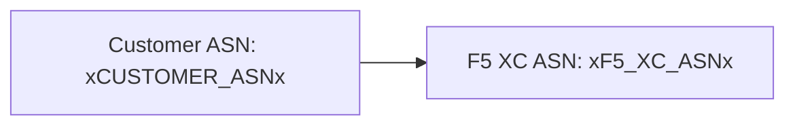

ตัวบิลเดอร์รองรับไดอะแกรม [Mermaid](https://mermaid.js.org/) ด้วยการประมวลผลแบบสองเฟส: ปลั๊กอิน remark ในช่วงบิลด์จะเตรียมมาร์กอัป และตัวเรนเดอร์ฝั่งไคลเอนต์จะสร้าง SVG

## ปลั๊กอิน Remark

ปลั๊กอิน remark-mermaid (จัดเตรียมโดยแพ็กเกจ npm `docs-theme`) ทำงานระหว่างการบิลด์ Astro โดยใช้ `unist-util-visit` เพื่อค้นหาบล็อกโค้ดแบบ fenced ที่มี `lang === 'mermaid'` และแทนที่ด้วย HTML:

```js
visit(tree, 'code', (node, index, parent) => {
  if (node.lang !== 'mermaid' || index === undefined || !parent) return;

  const escaped = node.value
    .replace(/&/g, '&amp;')
    .replace(/</g, '&lt;')
    .replace(/>/g, '&gt;')
    .replace(/"/g, '&quot;');

  parent.children[index] = {
    type: 'html',
    value: `<div class="mermaid-container" data-mermaid-src="${escaped}">
              <pre class="mermaid">${node.value}</pre>
            </div>`,
  };
});
```

รายละเอียดสำคัญ:

| ด้าน | ค่า |
|--------|-------|
| ประเภทโหนดที่จับคู่ | โหนด `code` ที่ `lang === 'mermaid'` |
| การ escape HTML entity | `&`, `<`, `>`, `"` — ป้องกันการ injection ของ attribute ใน `data-mermaid-src` |
| โครงสร้างผลลัพธ์ | `<div class="mermaid-container">` พร้อม attribute `data-mermaid-src` ที่เก็บซอร์สที่ escape แล้ว |
| เนื้อหาสำรอง | `<pre class="mermaid">` พร้อมซอร์สดิบ (แสดงจนกว่า JS จะเรนเดอร์) |

## การเรนเดอร์ฝั่งไคลเอนต์

ฟังก์ชัน `renderMermaidDiagrams()` ใน `src/scripts/placeholder-dom.ts` จัดการการสร้าง SVG ในเบราว์เซอร์

### การนำเข้า Mermaid

Mermaid ถูกโหลดตามต้องการจาก CDN — ไม่ได้รวมอยู่ในบันเดิล:

```ts
const mermaid = (await import('https://cdn.jsdelivr.net/npm/mermaid@11/dist/mermaid.esm.min.mjs')).default;
```

### การตั้งค่าเริ่มต้น

```ts
mermaid.initialize({
  startOnLoad: false,
  theme: 'default',
  securityLevel: 'loose',
  themeVariables: {
    primaryColor: '#ffffff',
    primaryBorderColor: '#cccccc',
    background: '#ffffff',
    mainBkg: '#ffffff',
    secondBkg: '#ffffff',
    tertiaryColor: '#ffffff',
  },
});
```

`startOnLoad: false` ป้องกัน Mermaid จากการสแกนหน้าเว็บโดยอัตโนมัติ `securityLevel: 'loose'` อนุญาตให้ใช้งานคลิกอีเวนต์และลิงก์ในไดอะแกรม

### ลูปการเรนเดอร์

สำหรับแต่ละอีลิเมนต์ `.mermaid-container`:

1. อ่านซอร์สไดอะแกรมดิบจาก `data-mermaid-src`
2. รันการแทนที่ placeholder บนซอร์ส (ดูด้านล่าง)
3. ล้างคอนเทนเนอร์และลบ attribute `data-processed` ออก
4. เรียก `mermaid.render()` ด้วย ID แบบสุ่มเพื่อสร้าง SVG
5. ตั้งค่า `backgroundColor: 'white'` บนอีลิเมนต์ `<svg>` ที่เรนเดอร์แล้ว

## การแทนที่ Placeholder ในไดอะแกรม

ก่อนการเรนเดอร์ ซอร์สไดอะแกรมจะผ่านฟังก์ชัน `substituteText()` เดียวกันกับที่ DOM walker ใช้ (ดู [ระบบ Placeholder](../placeholder-system/) สำหรับกลไก walker):

```ts
const template = container.getAttribute('data-mermaid-src') || '';
const substituted = substituteText(template, values);
```

นั่นหมายความว่า placeholder token เช่น `xCUSTOMER_ASNx` ทำงานได้ภายในนิยามไดอะแกรม Mermaid เมื่อผู้ใช้เปลี่ยนค่าในฟอร์ม อีเวนต์ `placeholder-change` จะทริกเกอร์การเรนเดอร์ใหม่ทั้งหมดของไดอะแกรมทุกตัวด้วยค่าที่อัปเดตแล้ว

## การจัดการข้อผิดพลาด

หาก `mermaid.render()` โยนข้อผิดพลาด (เช่น เนื่องจากไวยากรณ์ผิดพลาดในซอร์สไดอะแกรม) บล็อก catch จะแสดงข้อผิดพลาดโดยตรงในคอนเทนเนอร์:

```ts
} catch (e) {
  container.textContent = `Diagram error: ${e}`;
}
```

สิ่งนี้ทำให้ข้อผิดพลาดในการเขียนมองเห็นได้โดยไม่ทำให้ส่วนอื่นของหน้าเว็บเสียหาย

## การเรนเดอร์ซ้ำ

ไดอะแกรมจะเรนเดอร์ซ้ำในสองสถานการณ์:

| ตัวทริกเกอร์ | อีเวนต์ | สิ่งที่เกิดขึ้น |
|---------|-------|-------------|
| ค่า placeholder เปลี่ยนแปลง | `placeholder-change` | `handleChange()` เรียก `renderMermaidDiagrams()` ด้วยค่าใหม่ |
| การนำทางหน้าเว็บ Astro | `astro:page-load` | `init()` เรียก `renderMermaidDiagrams()` สำหรับหน้าใหม่ |

## ไวยากรณ์การเขียน

เขียนบล็อกโค้ดแบบ fenced มาตรฐานด้วยแท็กภาษา `mermaid`:

````markdown

````

ปลั๊กอิน remark จะแปลงสิ่งนี้เป็น div คอนเทนเนอร์ในช่วงบิลด์ ไคลเอนต์จะเรนเดอร์เป็น SVG โดยมีค่า placeholder ถูกแทนที่แล้ว
