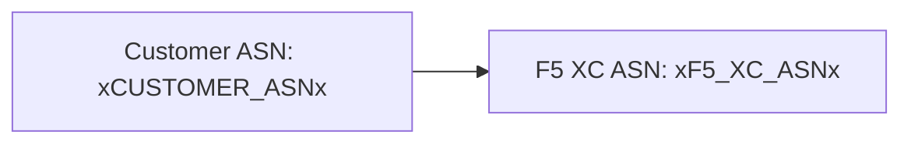

构建器通过两阶段处理支持 [Mermaid](https://mermaid.js.org/) 图表：remark 插件在构建时准备标记，客户端渲染器生成 SVG。

## Remark 插件

remark-mermaid 插件（由 `docs-theme` npm 包提供）在 Astro 构建期间运行。它使用 `unist-util-visit` 查找 `lang === 'mermaid'` 的围栏代码块，并将其替换为 HTML：

```js
visit(tree, 'code', (node, index, parent) => {
  if (node.lang !== 'mermaid' || index === undefined || !parent) return;

  const escaped = node.value
    .replace(/&/g, '&amp;')
    .replace(/</g, '&lt;')
    .replace(/>/g, '&gt;')
    .replace(/"/g, '&quot;');

  parent.children[index] = {
    type: 'html',
    value: `<div class="mermaid-container" data-mermaid-src="${escaped}">
              <pre class="mermaid">${node.value}</pre>
            </div>`,
  };
});
```

关键细节：

| 方面 | 值 |
|--------|-------|
| 匹配的节点类型 | `lang === 'mermaid'` 的 `code` 节点 |
| HTML 实体转义 | `&`、`<`、`>`、`"` — 防止 `data-mermaid-src` 中的属性注入 |
| 输出结构 | `<div class="mermaid-container">`，带有包含转义源码的 `data-mermaid-src` 属性 |
| 回退内容 | `<pre class="mermaid">` 包含原始源码（在 JS 渲染之前可见） |

## 客户端渲染

`src/scripts/placeholder-dom.ts` 中的 `renderMermaidDiagrams()` 函数负责在浏览器中生成 SVG。

### Mermaid 导入

Mermaid 按需从 CDN 加载 — 不会打包到项目中：

```ts
const mermaid = (await import('https://cdn.jsdelivr.net/npm/mermaid@11/dist/mermaid.esm.min.mjs')).default;
```

### 初始化

```ts
mermaid.initialize({
  startOnLoad: false,
  theme: 'default',
  securityLevel: 'loose',
  themeVariables: {
    primaryColor: '#ffffff',
    primaryBorderColor: '#cccccc',
    background: '#ffffff',
    mainBkg: '#ffffff',
    secondBkg: '#ffffff',
    tertiaryColor: '#ffffff',
  },
});
```

`startOnLoad: false` 阻止 Mermaid 自动扫描页面。`securityLevel: 'loose'` 允许图表中的点击事件和链接。

### 渲染循环

对于每个 `.mermaid-container` 元素：

1. 从 `data-mermaid-src` 读取原始图表源码
2. 对源码执行占位符替换（见下文）
3. 清空容器并移除所有 `data-processed` 属性
4. 使用随机 ID 调用 `mermaid.render()` 生成 SVG
5. 在渲染的 `<svg>` 元素上设置 `backgroundColor: 'white'`

## 图表中的占位符替换

在渲染之前，图表源码会经过与 DOM 遍历器相同的 `substituteText()` 函数处理（DOM 遍历器机制详见[占位符系统](../placeholder-system/)）：

```ts
const template = container.getAttribute('data-mermaid-src') || '';
const substituted = substituteText(template, values);
```

这意味着 `xCUSTOMER_ASNx` 等占位符标记可以在 Mermaid 图表定义中使用。当用户在表单中更改值时，`placeholder-change` 事件会触发所有图表使用更新后的值进行完整重新渲染。

## 错误处理

如果 `mermaid.render()` 抛出异常（例如，由于图表源码中的语法错误），catch 块会直接在容器中显示错误：

```ts
} catch (e) {
  container.textContent = `Diagram error: ${e}`;
}
```

这使编写错误可见，而不会影响页面其余部分的正常运行。

## 重新渲染

图表在两种情况下会重新渲染：

| 触发条件 | 事件 | 发生的操作 |
|---------|-------|-------------|
| 占位符值变更 | `placeholder-change` | `handleChange()` 使用新值调用 `renderMermaidDiagrams()` |
| Astro 页面导航 | `astro:page-load` | `init()` 为新页面调用 `renderMermaidDiagrams()` |

## 编写语法

使用 `mermaid` 语言标签编写标准围栏代码块：

````markdown

````

remark 插件会在构建时将其转换为容器 div。客户端会在替换占位符值后将其渲染为 SVG。
