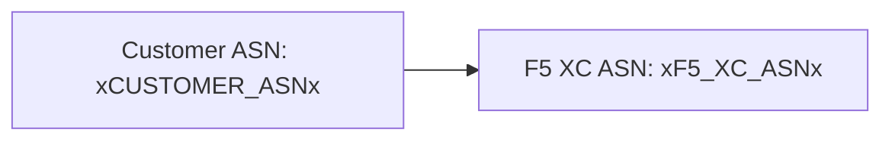

建構器支援 [Mermaid](https://mermaid.js.org/) 圖表，並採用兩階段處理：remark 外掛在建構時準備標記，客戶端渲染器則產生 SVG。

## Remark 外掛

remark-mermaid 外掛（由 `docs-theme` npm 套件提供）在 Astro 建構期間執行。它使用 `unist-util-visit` 尋找 `lang === 'mermaid'` 的圍欄程式碼區塊，並將其替換為 HTML：

```js
visit(tree, 'code', (node, index, parent) => {
  if (node.lang !== 'mermaid' || index === undefined || !parent) return;

  const escaped = node.value
    .replace(/&/g, '&amp;')
    .replace(/</g, '&lt;')
    .replace(/>/g, '&gt;')
    .replace(/"/g, '&quot;');

  parent.children[index] = {
    type: 'html',
    value: `<div class="mermaid-container" data-mermaid-src="${escaped}">
              <pre class="mermaid">${node.value}</pre>
            </div>`,
  };
});
```

關鍵細節：

| 面向 | 值 |
|--------|-------|
| 匹配的節點類型 | `lang === 'mermaid'` 的 `code` 節點 |
| HTML 實體跳脫 | `&`、`<`、`>`、`"` — 防止 `data-mermaid-src` 中的屬性注入 |
| 輸出結構 | `<div class="mermaid-container">` 搭配 `data-mermaid-src` 屬性存放跳脫後的原始碼 |
| 後備內容 | `<pre class="mermaid">` 包含原始原始碼（在 JS 渲染前可見） |

## 客戶端渲染

`src/scripts/placeholder-dom.ts` 中的 `renderMermaidDiagrams()` 函式負責在瀏覽器中產生 SVG。

### Mermaid 匯入

Mermaid 從 CDN 按需載入 — 並非打包在內：

```ts
const mermaid = (await import('https://cdn.jsdelivr.net/npm/mermaid@11/dist/mermaid.esm.min.mjs')).default;
```

### 初始化

```ts
mermaid.initialize({
  startOnLoad: false,
  theme: 'default',
  securityLevel: 'loose',
  themeVariables: {
    primaryColor: '#ffffff',
    primaryBorderColor: '#cccccc',
    background: '#ffffff',
    mainBkg: '#ffffff',
    secondBkg: '#ffffff',
    tertiaryColor: '#ffffff',
  },
});
```

`startOnLoad: false` 防止 Mermaid 自動掃描頁面。`securityLevel: 'loose'` 允許圖表中的點擊事件和連結。

### 渲染迴圈

對於每個 `.mermaid-container` 元素：

1. 從 `data-mermaid-src` 讀取原始圖表原始碼
2. 對原始碼執行佔位符替換（見下方）
3. 清除容器並移除任何 `data-processed` 屬性
4. 呼叫 `mermaid.render()` 並使用隨機 ID 來產生 SVG
5. 在渲染的 `<svg>` 元素上設定 `backgroundColor: 'white'`

## 圖表中的佔位符替換

在渲染之前，圖表原始碼會通過 DOM 遍歷器所使用的相同 `substituteText()` 函式（關於遍歷器機制，請參閱[佔位符系統](../placeholder-system/)）：

```ts
const template = container.getAttribute('data-mermaid-src') || '';
const substituted = substituteText(template, values);
```

這表示像 `xCUSTOMER_ASNx` 這樣的佔位符標記可以在 Mermaid 圖表定義中使用。當使用者在表單中更改值時，`placeholder-change` 事件會觸發使用更新後的值對所有圖表進行完整重新渲染。

## 錯誤處理

如果 `mermaid.render()` 拋出例外（例如，由於圖表原始碼中的語法錯誤），catch 區塊會直接在容器中顯示錯誤：

```ts
} catch (e) {
  container.textContent = `Diagram error: ${e}`;
}
```

這使得編寫錯誤可見，而不會影響頁面其餘部分。

## 重新渲染

圖表在兩種情況下會重新渲染：

| 觸發條件 | 事件 | 發生的事情 |
|---------|-------|-------------|
| 佔位符值變更 | `placeholder-change` | `handleChange()` 使用新值呼叫 `renderMermaidDiagrams()` |
| Astro 頁面導覽 | `astro:page-load` | `init()` 為新頁面呼叫 `renderMermaidDiagrams()` |

## 編寫語法

使用 `mermaid` 語言標籤撰寫標準圍欄程式碼區塊：

````markdown

````

remark 外掛在建構時將其轉換為容器 div。客戶端會將其渲染為已替換佔位符值的 SVG。
